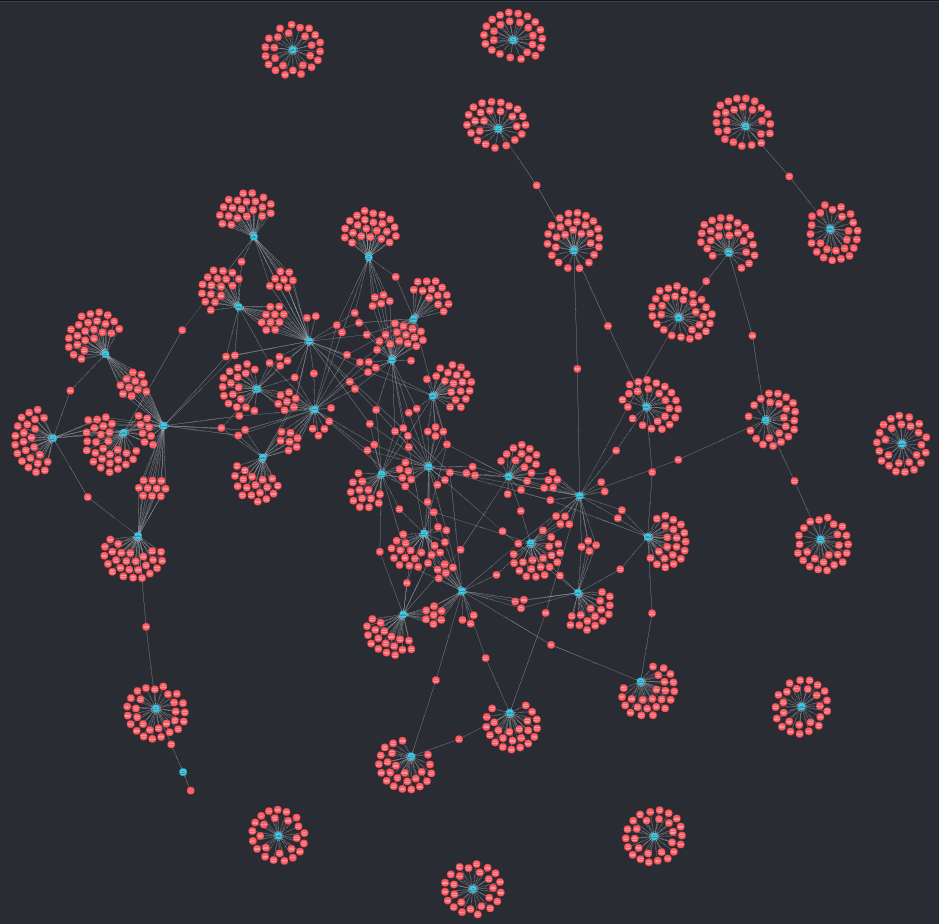

## Learning Neo4j with Garbage Television

I like social network data, and I want to learn graph databases, specifically neo4j. I do not like the 'romantic competition' shows; The Bachelor, The Bachelorette, and Bachelor in Paradise. I do like the sheer amount of scrapable data these shows expose on wikipedia. 

These scripts show my attempts at learning to:

* Scrape semi-structured wikipedia data
* Create and update a Neo4j graph database
* Write a decent document describing the above

The current results give you a network of the players and their starred-in and competed-in relationships with the various seasons of the various shows. Red node show players, and blue nodes show the individual seasons. 

## To Use

You'll need to `pip install` a few things:

* [BeautifulSoup](https://pypi.org/project/beautifulsoup4/)
	- `pip install beautifulsoup4`
* The neo4j [python driver](https://neo4j.com/developer/python/)
	- `pip install neo4j`
* [wikipedia-ql](https://github.com/zverok/wikipedia_ql)
	- `pip install wikipedia_ql`
	
You'll also need to install neo4j and have a local graph database running, with address and auth info to match what's in the scripts. You can get started [here](https://neo4j.com/download/?ref=try-neo4j-lp)
