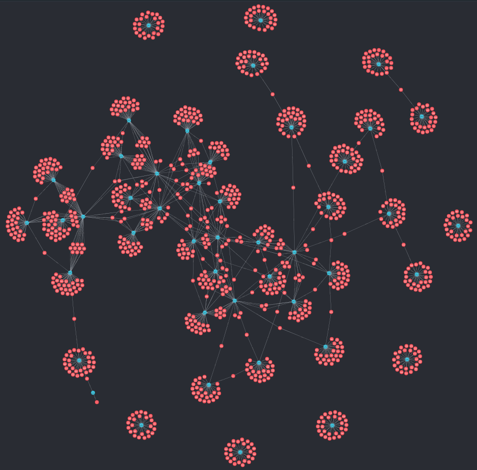

# 2021-12-02 more db

Trying to get the new query results into the db. 

Might throw it in a module now? just a single method. 

## Main and Paradise Seasons Gathered?
So thats working? The main and paradise seasons are now in the neo4j db. 

Pretty happy with that? 

## NOTE - The 'Missing' seasons
You have to remove seasons 3,4,6,7,8 of the og seasons. My wife has an explanation and its... long.

## Next Steps
I'd like to make sure the various uniqueness conditions are being respected. I am worried that 'single word names' might be causing conflicts. It'd be nice to find the best practice way of dealing with various kinds of unique-ness constraints in neo4j. 

I'd like to start writing this up in a more 'guide'/blogpost kind of way, too. Make it have sections mapping to the various concepts in the neo4j toolkit, and try to mirror the flow and structure of the og neo tutorials. Basically, make the flow follow those tutorials, but the focus/examples are an evolution of a garbagenet database. 

This would also require front matter for the scraping part. For that, you'd have to cover (at least quickly), both beautiful soup scraping, and using the newly released wikiql toolkit (need to make it clear that it's experimental).
